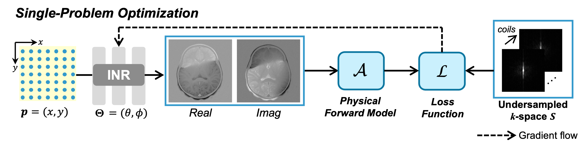
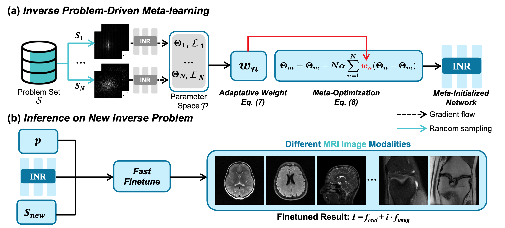

# IPOD
This is the official implementation of our ICLR 2026 submission,  
"IPOD: Inverse-Problem-Driven Meta-Learning for Fast Generalizable Neural Representations in MRI Reconstruction".


<p align="center">
  <br>
  <sub>Fig. 1: Pipeline of the single-problem optimization in MRI reconstruction.</sub>
</p>

<p align="center">
  <br>
  <sub>Fig. 2: Overview of the proposed IPOD framework.</sub>
</p>


# File Tree
```
IPOD/
├── Figs/                       # Visualization
│   ├── fig_1.pdf
│   ├── fig_1.png
│   ├── fig_2.pdf
│   └── fig_2.png
│
├── checkpoints/
│   └── model_epoch_2500.pth    # Checkpoint at epoch 2500 (IPOD initialization for SIREN)
│
├── data/
│   └── sample_0009.h5          # Sample MRI data in HDF5 format
│
├── README.md                   # Project documentation
├── SIREN_IPOD_demo.ipynb       # Demo notebook for SIREN-IPOD
├── SIREN_IPOD_train.py         # Training framework for SIREN-IPOD
├── SIREN_IPOD_utils.py         # Tools for SIREN-IPOD training
├── model_siren.py              # SIREN model architecture
├── utils.py                    # General tools
└── utils_test.py               # Testing tools
```


# Run a Demo
We provide a demo `SIREN_IPOD_demo.ipynb` to demonstrate how IPOD improves the convergence speed and performance of the SIREN.


# Main Requirements

To run this project, you will need the following packages:

- PyTorch
- tinycudann
- sigpy
- matplotlib
- tqdm
- numpy
- skimage
- other dependencies
